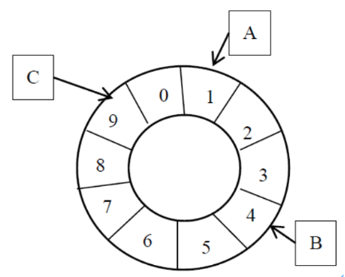

# 云存储

> D11-3009 专属
>
> Author：Anand Zhang
>
> [资源地址](https://github.com/anandzhang/review-Junior-2019)

## 云计算概述

### 定义

云计算是指用户可以方便的、按需通过网络访问共享可配置的计算资源池（网络、服务器、存储、应用和服务等），具有快速部署，最小的管理代价或最少的服务提供商干预的一种新型IT基础运行模式。

### 5个关键特征

- **按需自助服务**

  用户在购买、扩展服务的时候，直接从网络上获取，不需要云服务商的参与

- **广泛的网络访问**

  用户不仅要只要有手机、平板或电脑，还需要有网络，才可以获取云计算中的资源。

- **资源池化**

  - 服务商通过多租户的模式将汇聚在一起的计算资源根据用户的实际需求动态分配服务多个消费者，资源以分布式共离方式存在，最终以单一整体的形式显现给用户
  - 用户与用户之间是基于软件实现的隔离
  - 资源是用户共享的

- **快速强性**

  - 服务商可以快速而弹性的实现供应

    如果现有服务器利用率不高，可以采用弹性扩展方法，缩减使用的资源，以减少服务开支，降低成本。

    如果云服务器的性能不能满足要求时，除了采用向上扩展（Scale up）的方法进行扩展外，还可采用横向扩展的方式进行弹性扩展。

  - 用户可以快速弹性动态伸缩

  - 两种扩展模式（横向扩展（scale out）、向上扩展（scale up））

- **可监控和测量的服务**

  根据用户使用运资源的时间长短及资源多少进行服务收费，优化了资源的使用

### 4种云计算部署模式

公有云、私有云、社区云、混合云

#### 公有云的基础设施

- 地区（Region）

  其中位于不同的地理位置，相互之间一般只能通过公网连通，相互之间互相隔离，资源不会自动互相复制指的是地区

- 可用区（AZ）

  由一个或多个离散数据中心组成，每个数据中心都具有冗余电源、联网和连接性，位于独立的各个设施中。数据中心之间通过高速网络互相连接。

> 用户负责选择系统将驻留的可用区。系统可以跨越多个可用区。

### 云计算的3种服务模式

#### Iaas

IaaS是一种服务交付模式，在此模式中，以按需服务的方式提供服务器、存储、和网络设备的基本计算基础设施，从而建立用于开发和执行应用程序的平台。

在IaaS服务中，管理身份和访问管理安全是由使用云服务的客户负责。 监控物理设备，退役磁盘处理，硬件故障修复由云服务商负责

#### Paas

PaaS是指计算平台作为一种按需服务而应用在计算平台上进行开发和部署的服务交付模式，旨在降低购买、存储、管理平台底层硬件和软件组件的成本及复杂度，包括所有必要的程序和数据库开发工具。

在PaaS模式下，开发环境基本上都具有特殊用途，由云服务提供商根据平台的设计和架构进行定制；云用户可控制平台的应用和应用环境的设置。此外，安全保障措施由云服务商和云用户共同承担。

#### SaaS

SaaS是指一个或多个应用以及运行应用的计算资源通过按需的方式以交钥匙的形式进行服务交付的模式，旨在减少硬件和软件开发、维护及运行的总成本。

在SaaS模型下，安全保障措施主要由云服务商提供；除去可以进行为数不多的喜好选择以及有限的应用设置外，云用户并不管理或控制底层的云基础设施或单独的应用程序。

### 2大研究方向

云和端

### 1大关键宗旨

一切皆服务

## 云存储概述

### 数据三种分类

#### 结构化数据

数据结构字段含义确定,清晰,典型的如数据库中的表结构.可以用二维表结构来逻辑表达实现的数据

#### 半结构化数据

是介于完全结构化数据（如关系型数据库、面向对象数据库中的数据）和完全无结构的数据（如声音、图像文件等）之间的数据，具有一定结构,但语义不够确定，HTML文档就属于半结构化数据。它一般是自描述的，数据的结构和内容混在一起，没有明显的区分

#### 非结构化数据

杂乱无章的数据,很难按照一个概念去进行抽取,无规律性。包括视频、音频、图片、图像、文档、文本等形式

### 存储领域两个重要的技术

数据的增涨导致了以“计算”为中心到以“数据存储“为中心

#### 并行存储

磁盘阵列技术

#### 网络存储

NAS，SAN

### RAID 技术

RAID(Redundant Array Of Independent Disks)即独立磁盘冗余阵列，它是将多个单独的物理硬盘以不同的方式组合成一个逻辑硬盘，从而提高硬盘的读写性能和数据安全性。

#### RAID0 数据条带化

RAID 0即没有容错设计的条带硬盘阵列（Striped Disk Array without Fault Tolerance），以条带形式将RAID组的数据均匀分布在各个硬盘

> RAID 0是所有RAID级别中**存储性能最高**的。

#### RAID1 数据镜像

RAID1又称镜像(Mirror)，数据同时一致写到主硬盘和镜像硬盘，主硬盘和镜像硬盘数据互为备份。

> 提高了数据安全性和可用性。

> 两块硬盘仅能提供一块硬盘的容量。100%的数据冗余

#### RAID5 数据条带化、校验信息分布式存放

RAID5采用相对简单的异或逻辑运算方式进行较验，校验数据均匀分布在各数据硬盘上，RAID5成员硬盘上同时保存数据和校验信息，数据块和对应的校验信息保存在不同硬盘上。

> 高读取速率，中等写入速率；提供一定的数据安全性。

#### RAID10

RAID10是将镜像和条带进行两级组合的RAID级别，第一级是RAID1镜像对，第二级为RAID0。

> 同时拥有RAID 0的超凡速度和RAID 1的数据高可靠性；磁盘利用率较低50%

#### 可靠性和性能

在客户更关注可靠性的情况下，可以考虑推荐用户使用RAID1、RAID5方案

在客户更关注性能的情况下，可以考虑推荐用户使用RAID0、RAID5方案

> 图形工作站：迅速读写，安全性要求不高，RAID0
>
> 随机数据写入，安全性要求高：数据库存储，RAID1，RAID5
>
> 银行、金融：数据量大，安全性要求高，RAID10

> 6个 1T 硬盘，RAID0 后的存储空间为 6T，RAID1：3T， RAID5：3T

### 数据网络存储方法

#### DAS

DAS是Direct Attached Storage的缩写，即“直接连接存储”。

是指将外置存储设备通过连接电缆，利用SCSI技术，或者FC(Fibre Channel)技术，直接挂接在内部总线上的方式，直接连接到一台计算机上。数据存储是整个服务器结构的一部分，在这种情况下往往是数据和操作系统都未分离。

直连式存储依赖服务器主机操作系统进行数据的IO读写和存储维护管理，数据备份和恢复要求占用服务器主机资源（包括CPU、系统IO等

#### SAN

SAN（Storage Aera Network ）存储区域网络。

存储设备通过专用交换机到一群计算机上。在该网络中提供了多主机连接，允许任何服务器连接到任何存储阵列

#### NAS

NAS（Network Attach Storage）网络附加存储。

是一种文件共享服务。拥有自己的文件系统，通过NFS或CIFS对外提供文件访问服务，服务是通过TCP/IP的网络提供的。

### 对象存储

#### 传统存储方式

##### 块存储

直接访问原始的未格式化的磁盘，速度快、空间利用率高，多用于数据库系统存储结构化数据

##### 文件存储系统

使用格式化的硬盘，提供文件系统使用界面，存放日常文件，图片等非结构化数据，不适合管理大量数据，或超量使用文件中的部分数据

> 传统存储存在容量和性能瓶颈：PB级的容量，对高并发、高吞吐量的应用支持不够。

#### 定义

提供对整个对象的访问，存放非结构化或半结构化的数据，适合管理大量的数据，容量可以无限增长

#### 基本概念

- 对象

  就是存储在系统中的真正数据，类似于文件系统中的文件，有自己的ID(URI)，需要对象名与账户名、容器名一起构成访问唯一的命名空间,实现对对象的访问。

  对象由数据和元数据构成

  元数据包括：系统内置属性、访问控制列表（ACL）、用户自定义属性

- 容器

  用来把对象进行分组，类似于文件系统中的目录，容器只有一级，有自己的ID(URI)

  访问接口：通过Web服务协议实现对数据和存储资源的访问

  一个账户有零到多个容器，一个容器有零到多个对象，容器只有一级

#### 逻辑结构

- 采用扁平化结构管理所有数据：对象，容器

- 只需要根据ID就可以直接访问对象，容器

- 访问对象并不需要首先访问容器

#### 物理结构

- 认证服务器

- 代理服务器

  提供对外的服务接口（EndPoint），并负责接受和处理对Swift的所有请求，负责把用户请求分发给合适的存储服务器

  ​       负责把用户请求分发给合适的存储服务器

- 存储服务器

  为整个集群提供磁盘存储空间。负责存放实际的数据。

  - 账号存储服务器

    存放着该容器里的所有容器的信息

  - 容器存储服务器

    存放着该容器里的所有对象的信息

    > 没有对象存储地址的信息

  - 对象存储服务器

    负责存储对象的数据及元数据

### 对象存储的读写

#### Swift 下载对象基本处理流程

1. 认证
2. 用户向Swift代理服务器发出下载对象请求
   1. 接收到下载对象的请求时，Swift通过对账号名、容器名和对象名进行哈希来得到该对象所在的虚节点
   2. Swift通过环来发现包含该节点的所有存储节点，并给其中的一个存储节点发送请求获取所需对象的数据
   3. 如果存储节点出现故障，Swift会向下一个存储节点发送请求

#### Swift 上传对象基本处理流程

1. 认证
2. 用户向Swift代理服务器发出上传对象请求
   1. 在接到PUT请示后，Swift首先通过使用账号名、容器名以及对象名来决定对象的数据应当安置在哪个虚节点
   2. Swift通过环来发现哪些存储节点包含这个虚节点。并将数据存放到相应的虚节点
   3. 只有当规定个数的副本成功存储后，Swift才能告知客户上传对象已经成功完成，一般来讲，至少3个副本中的2个副本必须 成功存储，才算上传成功完成
   4. 上传成功后，Swift还会异步更改所在容器的容器数据库来反映新上传的对象

### 对象存储的实现

#### 虚节点

数据迁移的最基本的单位为虚节点

当增加或减少节点时，虚节点会发生迁移。

#### 环（一致性 Hash）

Swift系统中用part_power参数来表示虚节点(partition)的幂次方

> 例：假设系统中有300块硬盘，每块硬盘中存放100个虚节点，请计算 part_power 的值。
>
> 思路：求2的多少次方会大于总虚节点数（总虚节点数 = 硬盘个数 * 每个硬盘虚节点数）
>
> $2^{15}=32768>30000$  

### Swift 的使用

#### Swift 命令

使用 `swift <command>` 

| 命令     | 操作                                 |
| -------- | ------------------------------------ |
| delete   | 删除容器或容器里的对象               |
| list     | 获取账号的容器列表或者容器的对象列表 |
| post     | 将本地文件或者目录上传到容器         |
| download | 从容器中下载对象                     |
| stat     | 显示账号、容器、对象的使用信息       |

#### tempAuth 授权

```shell
export ST_KEY=
export ST_USER=
export ST_AUTH=
```

#### Swift HTTP API

| 操作   | URL                       | 描述             |
| ------ | ------------------------- | ---------------- |
| HEAD   | /account/container/object | 获取对象元数据   |
| POST   | /account/container/object | 更改对象元数据   |
| PUT    | /account/container/object | 创建或上传对象   |
| DELETE | /account/container/object | 删除对象         |
| GET    | /account/container/object | 获取对象详细信息 |

> 使用 CURL 命令示例：
>
> curl 的几个选项参数：
>
> `-X <method>` 请求的HTTP方法
>
> `-i` 要求把 HTTP 响应的头部也显示到窗口
>
> `-H <header>` 在请求中添加一个HTTP头
>
> 1. 认证
>
>    ```shell
>    curl -i -X GET -H "X-Auth-User: <user>" -H "X-Auth-Key: <password>" http://auth.cloud.nsu/v1.0
>    ```
>
> 2. 获取 data 容器下对象列表
>
>    ```shell
>    curl -i -X GET -H "X-Auth-Token: <token>" http://storage.cloud.nsu/v1/data
>    ```
>
> 3. 创建一个data1容器。并设置容器元数据 Hello 为 world。
>
>    ```shell
>    curl -i -X PUT -H "X-Auth-Token: <token>"  -H "X-Container-Meta-Hello:world" http://storage.cloud.nsu/v1/data1
>    ```
>
> 4. 在创建的 data1 容器下，上传一个 hello.jpg 文件。并设置对象元数据 New 为 world。
>
>    ```shell
>    curl -i -X PUT -H "X-Auth-Token: <token>" -T "hello.jpg" -H "X-Object-Meta-New:world" http://storage.cloud.nsu/v1/data/hello.jpg
>    ```
>
> 5. 获取 hello.jpg 对象元数据
>
>    ```shell
>    curl -i -X HEAD -H "X-Auth-Token: <token>" -H "X-Object-Meta-New:world"
>    http://storage.cloud.nsu/v1/data/hello.jpg
>    ```
>
> 6. 获取上传好的 hello.jpg
>
>    ```shell
>    curl -i -X GET -H "X-Auth-Token: <token>"
>    http://storage.cloud.nsu/v1/data/hello.jpg
>    ```

> 相关元数据的设置：
>
> 容器元数据：`X-Container-Meta-<xxx>` 
>
> 对象元数据：`X-Object-Meta-<xxx>` 

#### 失效时间

- 对象绝对失效时间 `X-Delete-At` 
- 对象相对失效时间`X-Delete-After` 

#### 动态大对象

对于大于5G的对象，必须进行分割，并利用**manifest对象**来告知Swift。

#### 版本化

上传对象将前一个版本备份到关联目录，删除对象相关于回滚操作，回到前一个版本。 `X-Versions-Location` 

### Swift 实现的基本原理

#### 数据分布的方法

- 单机系统与分布式系统的最大的区别在于问题的规模，即计算、存储的数据量的区别
- 将一个单机问题使用分布式解决，首先要解决的就是如何将问题拆解为可以使用多机分布式解决，使得分布式系统中的每台机器负责原问题的一个子集
- 由于无论是计算还是存储，其问题输入对象都是数据，所以如何拆解分布式系统的输入数据并将数据分配到多台机器，是分布式系统需要解决的问题

#### 简单 Hash 数据分布方式

按照数据的某一特征计算哈希值，并将哈希值与机器中的机器建立映射关系，从而将不同哈希值的数据分布到不同的机器上。利用哈希函数和求模运算，即可实现数据到存储节点的映射。

优点：记录的元信息非常简单：哈希函数、模

缺点：可扩展性不强，数据倾斜。

#### 按数据范围分布

按数据范围分布是将数据按特征值的值域范围划分为不同的区间，使得集群中每台（组）服务器处理不同区间的数据。

优点：可以根据数据量的具体情况拆分原有数据区间；扩容时可以任意添加机器

缺点：需要维护较为复杂的元信息

#### 一致性 Hash 数据分配方法

用一个哈希函数计算数据或数据特征的哈希值，令该哈希函数的输出值域为一个封闭的环，即哈希函数输出的最大值是最小值的前序。将节点随机分布到这个环上，每个节点负责处理从自己开始顺时针至下一个节点的全部哈希值域上的数据。



##### 引入了虚拟节点的一致性 Hash


为实现系统存放数据的可持久性、可用性、可扩展性采取了一系列的措施。

可持久性：

​    Swift引入了多副本机制，3个副本，保证99.99999999%的持久性

### 副本

指在分布式系统中为数据或服务提供的冗余

- 数据副本。对于数据副本指在不同的节点上持久化同一份数据，当出现某一个节点的存储的数据丢失时，可以从副本上读到数据。数据副本是分布式系统解决数据丢失异常的唯一手段
- 服务副本，指数个节点提供某种相同的服务，这种服务一般并不依赖于节点的本地存储，其所需数据一般来自其他节点。

### 副本的作用

提高可靠性

- 一个数据副本被破坏后，只需要转换到另一个副本就可继续运行

- 多个数据副本可防止数据被破坏，多个服务副本可防止服务失效

提高性能

- 对服务器扩展，可分担工作负载；进程与数据副本在一起，可提高系统性能。地理位置扩展需要进行数据复制

**可用性：**

​    尽可能独特算法（unique-as-passible）：Swift 在选择副本的存储节点时，尽可能选择在没有副本的地域来存放，考虑区域（zone）,再是服务器，最后是驱动器。

### CAP 理论

- **一致性（Consistency)**：数据系统在执行过某项操作后，所有节点在同一时间都具有最新的值，所以不管用户访问哪一个节点都会读取 到最新的值

- **可用性（Availability)**：每一个操作总是能够在一定的时间内返回结果，"一定时 间内"是指，系统的结果必须在给定时间内返回，如果超 时则被认为不可用

- **分区容错性（Partition Tolerance)**：除了整个网络的故障外，其他的故障（集）都不能导致 整个系统无法正确响应

> CAP是在分布式环境中设计和部署系统时所要考虑的三个重要的系统需求
>
> 根据CAP理论，数据共享系统只能满足这三个特性中的两个，而不能同时满足三个条件
>
> 为保证Swift中存储数据的可持久性，Swift放弃了一致性的要求，选择了分区容忍性和可用性

> 例：哪些系统需要强/弱/最终一致性？
>
> - 银行的ATM系统：强一致
>
> - 飞机售票系统：强一致
>
> - 新浪网站系统：最终一致
>
> - 计科系教育平台：没有

Swift 采用**Quorum仲裁协议**来保证系统的一致性

### NRW 理论

N：数据的副本总数；W：写操作被确认接受的副本数量；R：读操作的副本数量。

强一致性：R+W>N，以保证对副本的读写操作会产生交集，从而保证可以读取到最新版本。

写操作需要满足至少一半以上成功W>N/2

> 例：NWR策略中，当W>N/2时，可保证两个事务不能并发写某一对象，请问在N=3,W=2情况下，能否出现副本不一致，为什么？如果要达到强一致性，R应当为多少？
>
> - 在N=3的情况下，如果有写操作能同时对两个副本完成写的操作的话，三个副本都将会出现不一致的值，系统将无法达到最终一致性的要求。
> - 当w>N/2时，只有写了半数以上副本才算成功，写不对就返回失败。由于W>N/2，不会出现两个写同时完成的情况，相当于一个写锁。
> - 由于写入操作不能同时完成，不会出现三个副本都不一致的情况，系统可以达到最终一致性。

### Swift 中一致性的保障机制

一致性服务器：负责发现和改正由于数据损坏和硬件故障带来的错误。

由三个服务构成：

- 审计器

  审计器运行在Swift后台，会在本地服务器上反复检测存放在该服务器上的对象、容器和账号的完整性。

  发现错误，审计器会把受损的对象移动到隔离区，由复制器重新生成一个好的副本来代替原来的副本。

  出现其他错误，审计器会把相关的错误记录到日志。

- 复制器

  复制器保证集群中的数据存储在正确的地方，以及每个数据有足够多的副本，以应对网络中断或驱动器故障等临时故障时保持系统的一致性，复制器也用于完成数据从系统中移除。

  - 复制服务器会不断检查每个虚节点，并把每个本地虚节点和该虚节点在其他区域的副本进行比较来发现不一致
  - 复制服务器通过检查虚节点中的每一个目录的Hash值来发现副本是不是相同的，发现哪个目录的Hash值不同，就把需要复制的那个目录复制过来
  - 完成删除数据的移出时。当有一项数据（对象、容器、账户）需要删除时，swift会把一个墓碑文件（.ts）设置为该数据的最新版本，复制器检测到墓碑文件时，会把该数据项从文件中移出

- 更新器

  保证容器或账号的数据以后在与存储服务器一致。当高负荷时，账号元数据中对象的个数、容器的个数以及所使用存储的字节数不会立即更新，会将此次更新加入更新队列，由更新器后续处理，但保证用户可以使用。

### Swift 环及其实现

Swift中账号、容器和单个对象在集群中的位置都是通过环来确定的账号、容器、对象各有自己的环。

一致性 Hash 实现：

把所有的哈希值组成一个首尾相接的环（0 – 2^32） 将环分割成N份（N个虚节点，移位产生）， 需要存储的对象通过Hash映射到哈希环的某个值上 再从哈希值出发沿顺时针方向遇到的第一个虚节点负责存储 通过虚拟节点到真实节点的映射表，确定将虚拟节点入到哪个真实节点中


> 当虚节点数量确定后，从对象映射到的虚节点不会发生变化

> Swift系统中，当增加或减少节点时，虚节点会发生迁移

### NoSQL 数据库

#### 四大类 NoSQL 数据库

- 列存储类型：列簇式存储，同一列数据存储在一起；对同一列数据查找数据快；

- 文档存储类型：Key-Value对应的键值对，Value为结构化数据；数据结构要求不严格，表结构可变

- Key-Value 存储：Key—value键值对存储，数据无结构，查找速度快

- 图结构数据库：图结构；利用图结构相关算法

#### MongoDB

数据库导入：

```shell
mongoimport -d test -c restaurants --drop --file ~/downloads/primer-dataset.json
```

> `--drop` drop collection first

切换数据库：

```shell
use test
```

查询操作：

```shell
db.restaurants.find({ "borough": "Manhattan" })
db.restaurants.find({ "grades.score": { $gt: 30 }})
```

> $gte 大于等于
>
> $lt 小于 { <key>: { $lt: <value>}}

> AND 逗号
>
> OR
>
> ```shell
> db.col.find(
>    {
>       $or: [
>          {key1: value1},
>          {key2: value2}
>       ]
>    }
> )
> ```