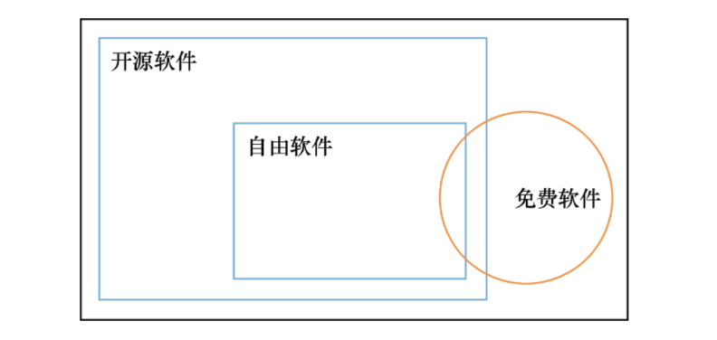
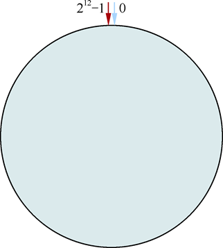
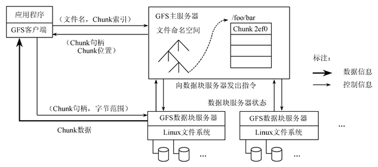
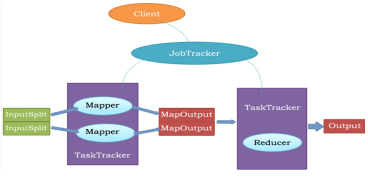
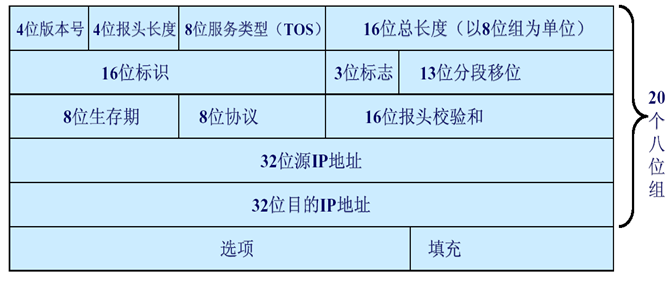

# 云计算

> D11-3009 专属
>
> Author：Anand Zhang
>
> [资源地址](https://github.com/anandzhang/review-Junior-2019)

## 第一章 云计算概述

### 云计算

#### 定义

通过网络提供可伸缩的、廉价的分布式计算能力，用户只需要在具备网络接入条件的地方，就可以随时随地获得所需的各种IT资源。

> 云计算是各种虚拟化、效用计算、服务计算、网格计算、自动计算等概念的混合演进并集大成之结果。

#### 公共特征

弹性伸缩、快速部署、资源抽象、按用量收费、宽带访问

#### 分类

##### 根据云的部署模式和云的使用范围进行分类：

公有云、私有云（专属云）、社区云、混合云、行业云、其他云类型

##### 根据云计算的服务层次和服务类型进行分类

- 基础设施即服务（IaaS）全称：Infrastructure as a Service
- 平台即服务（PaaS）全称：Platform as a Service
- 软件即服务（SaaS）全称：Software as a Service

#### 三元认识论

- 云计算作为一种商业模式
  - 云计算服务代表一种新的商业模式，SaaS（软件即服务）、PaaS（平台即服务）和IaaS（基础设施即服务）是这种商业模式的表现形式。
- 云计算作为一种计算范式
  - 可以分成哪两种结构？**横向云体逻辑结构**、**纵向云栈逻辑结构**
- 云计算作为一种实现方式
  - 云计算最终的实现方式是需要新一代的软硬件技术推动，即目前流行的数据中心，并且朝着软件定义的数据中心（Software Defined Data Center，SDDC）所演进。
  - 数据中心是云计算实现的最终归属，包括全方位的计算、存储和通信需求。

#### 优势

- 按需供应的无限计算资源
- 无须事先花钱就能使用的IT架构
- 基于短期的按需付费的资源使用
- 单机难以提供的事务处理环境

#### 缺点

- 脱机无法使用
- 隐私与安全问题
- SaaS 的功能相对于本地软件的功能还是有一定差距的

### 大数据

#### 定义

海量数据或巨量数据，其规模巨大到无法通过目前主流的计算机系统在合理时间内获取、存储、管理、处理并提炼以帮助使用者决策。

#### 特征

- 价值密度低。在成本可接受的条件下，通过快速采集、发现和分析，从大量、多种类别的数据中提取价值的体系架构。
- 快速。数据增长速度快，而且越新的数据价值越大，这就要求对数据的处理速度也要快，以便能够从数据中及时地提取知识，发现价值。
- 复杂度。对数据的处理和分析的难度大。
- 数据量大。存储的数据量巨大，PB级别是常态，因而对其分析的计算量也大。
- 多样。数据的来源及格式多样，数据格式除了传统的结构化数据外，还包括半结构化或非结构化数据，比如用户上传的音频和视频内容。而随着人类活动的进一步拓宽，数据的来源更加多样。

#### 与云计算的关系

$$
G=f(x)
$$

> G为我们的目标，f为云计算，x为大数据。

### 其他

**分布式计算**：通过网络连接多台相互独立的计算机，这些计算机相互协作，共同完成一个目标和计算任务。

网格计算：利用互联网将分散在不同地理位置的计算机组织成一台“虚拟的超级计算机”，把要计算的数据分割成若干“小片”，将小片分给每台计算机，计算结束后再返回给计算任务的总控节点。

并行计算（选择）：

- 并行计算（Parallel Computing）是指同时执行多个指令的计算模式，其原理为一个“大”问题可以被分解为多个同时处理的“小”问题。
- 并行计算的主要动力在于加快计算速度，因此确定问题分解的并行算法，对于并行计算而言至关重要，所以在结构上并行计算是紧耦合（Tight Coupling）的概念。
- 在软件工程中，“耦合”指的是互相交互的系统彼此间的依赖。紧耦合表明模块或者系统之间关系紧密，存在明显的依赖关系。

云计算数据中心（选择）：

- 云计算数据中心是一整套复杂的设施，包括服务器、宽带网络连接、环境控制设备、监控设备以及各种安全装置等
- 数据中心是云计算的重要载体，为云计算提供计算、存储、带宽等各种硬件资源，为各种平台和应用提供运行支撑环境
- 全国各地推进数据中心建设

### 了解

1. 开源，即开放一类技术或一种产品的源代码、源数据、源资产等，可以是各行业的技术或产品，其范畴涵盖文化、产业、法律、技术等多个社会维度。如果开放的是软件代码，一般被称作开源软件。
2. 开源的价值和意义：
   - 开源生态促进国家信息技术创新，带动经济发展
   - 软件厂商依托开源技术提升研发能力
   - 用户使用开源技术改变信息化路线
   - 企业自主开源，引领技术发展路径

### Q & A

#### 云计算数据中心建设的位置应该如何选择？

电价、散热成本、场地成本、人力成本。

#### 开源软件、自有软件和免费软件的关系

## 第二章 分布式计算

### 分布式计算

#### 定义

多个通过网络互联的计算机都具有一定的计算能力，它们之间互相传递数据，实现信息共享，协作共同完成一个处理任务。

#### 原理

分布式计算就是将计算任务分摊到大量的计算节点上，一起完成海量的计算任务。也就是将一个复杂庞大的计算任务适当划分为一个个小任务，分布式计算会将这些任务分配到不同的计算节点上，每个计算节点只需要完成自己的计算任务即可，可以有效分担海量的计算任务。而每个计算节点也可以并行处理自身的任务，更加充分利用机器的CPU资源。最后再将每个节点的计算结果汇总，得到最后的计算结果。

#### 步骤

一般分为一下几步：

- 设计分布式计算模型
- 分布式任务分配
- 编写并执行分布式程序

#### 优点

- 稀有资源可以共享
- 可以在多台计算机上平衡计算负载
- 可以把程序放在最适合运行它的计算机上。（怎么放在最适合的？动态算法）

### 几个理论

#### ACID原则

数据库事务正常执行的四个原则，分别指**原子性**、**一致性**、**独立性**、**持久性**。

#### CAP理论

一个分布式系统最多只能同时满足**一致性**、**可用性**和**分区容错性**这**三项中的两项**。

#### BASE理论

基本可用、软状态、最终一致性。

> 软状态是指允许系统存在中间状态，而该中间状态不会影响系统整体可用性。

一致性散列：将整个散列值空间组织成一个虚拟的圆环。

> 例：假设某散列函数H的值空间为 0 ~ $2^{32}-1$（即散列值是一个32位无符号整形），整个散列空间环如图所示。
>
> 

### 分布式系统

#### 特性

容错性、高可扩展性、开放性、并行处理能力、透明性。

#### Hadoop

Hadoop由两个重要模块组成。

- Hadoop分布式文件系统（Hadoop Distributed File System）HDFS。
  - 是一个分布式的文件系统，可以将文件数据分布式地存储在集群中的不同节点上。
- MapReduce系统
  - 是一个针对大量数据的分布式计算系统。

Hadoop特性：高可靠性、高可扩展性、高效性、高容错性、低成本。

#### GFS 分布式文件存储

##### 设计思路

- 将文件划分为若干块（Chunk）存储，每个块固定大小（64M）
- 通过冗余来提高可靠性。每个数据块至少在3个数据块服务器上冗余
- 通过单个master来协调数据访问、元数据存储。结构简单，容易保持元数据一致性
- 无缓存

##### 架构

##### 容错机制

- Master 容错
  - 三类元数据：命名空间（目录结构）、Chunk与文件名的映射以及Chunk副本的位置信息
  - 前两类通过日志提供容错，Chunk副本信息存储于Chunk Server，Master出现故障时可恢复
- Chunk Server容错

##### Master节点的任务

- 垃圾回收
- 陈旧数据块删除

#### HDFS（Hadoop分布式文件系统）

##### 定义

HDFS是一个主从式的分布式文件系统，是GFS的一种开源实现。

**HDFS可以利用大量廉价存储器组成分布式存储集群**，取代昂贵的集中式磁盘存储阵列。而**HDFS集群由一个NameNode和多个DataNode组成**，除此之外还有用于热备份的Secondary NameNode，防止集群出现单点故障

##### 组成

NameNode、Secondary NameNode、DataNode

#### MapReduce模型

MapReduce既是Hadoop中的模块，也是一个计算模型。

用户需要自己将算法划分成Map和Reduce两个阶段。首先将数据划分为小块的数据，将数据分配到不同计算节点的Map任务中计算，然后将计算结果汇总到Reduce节点中进行合并，得出最终结果。

##### 流程

本地计算（Map) => 洗牌（Shuffle）=>合并再计算（Reduce）

##### 流程图

#### 典型分布式系统

网格系统、P2P系统、透明计算、区块链系统。

> 网格是一种能够将多组织拥有和管理的计算机、网络、数据库和科学仪器综合协同使用的基础设施。网格应用程序大多涉及需要跨越组织界限的可安全共享的大规模数据和/或计算资源。这使网格应用程序的管理和部署成为一项复杂的任务。在混杂的网格环境中，网格中间件为用户提供了无缝的计算能力和统一访问资源能力。目前，世界范围内已经发展有数个工具包和系统，其中大部分是学术研究项目的成果。
>
> 对等网络系统（Peer-to-Peer），简称P2P系统，即媒体及公众所称的“点对点系统”，是一种应用在对等者（Peer）之间分配任务和工作负载的分布式应用架构的系统。对等网络的思想是：网络的所有参与者共享他们所拥有的一部分硬件资源，包括处理器资源、存储资源和网络资源等，这些共享资源可以通过网络被其他对等者直接访问并为之提供服务和内容。
>
> P2P系统性质：高度分散化、自组织性、多管理域。
>
> 透明计算是一种用户无须感知计算机操作系统、中间件、应用程序和通信网络的具体所在，只需根据自己的需求，通过网络从所使用的各种终端设备（包括固定、移动及家庭中的各类终端设备）中选择并使用相应服务（例如计算、电话、电视、上网和娱乐等）的计算模式。
>
> 区块链（Blockchain）是一种去中心化、不可篡改、可追溯、多方共同维护的分布式数据库系统，能够将传统单方维护的仅涉及自己业务的多个孤立数据库整合在一起，分布式地存储在多方共同维护的多个节点，任何一方都无法完全控制这些数据，只能按照严格的规则和共识进行更新，从而实现了可信的多方间的信息共享和监督，避免了烦琐的人工对账，提高了业务处理效率，降低了交易成本。（比特币--）

### 其他

### Q & A

1. 分布式计算和并行计算一样吗？
   - 并行计算要求投入更多机器，数据大小不变，计算速度更快。（更快完成任务）
   - 分布式计算要求投入更多的机器，能处理更大的数据。（更复杂的任务）

2. 传统的结构化存储系统强调以下内容（与分布式系统有什么区别？）：
   - 结构化的数据（例如关系表）
   - 强一致性（例如银行系统，电商系统等场景）
   - 随机访问（索引、增删查改、SQL）

## 第三章 云计算架构

### 讲的几种架构

中央集权架构、客户机/服务器结构（C/S）、中间层架构、浏览器/服务器架构（B/S）、C/S与B/S混合架构、面向业务的架构。

### 数据中心

数据中心（Data Center）是数据集中存储、计算、交换的中心。

云数据中心的构造主要有两种模式：

- 传统模式。即建机房、布线、放置机器，然后连接起来。
- 基于集装箱的数据中心。使用集装箱作为机房，每个集装箱里安置有上千台服务器，最多可达2500台，集装箱可以叠起或并排放置，集装箱之间通过线缆连接形成巨大的数据中心。

### 云栈

**云栈又称云平台，是在云上面建造的运行环境。**它能够支持应用程序的发布、运行、监控、调度、伸缩，并为应用程序提供辅助服务的机制，如访问控制和权限管理等。如微软的Windows Azure、谷歌的App Engine、VMWare的Cloud Foundry都是云平台。

在云栈里，每一层都提供一种抽象。最下面的是物理硬件层，之后每往上一层，其离物理现实的距离就更远一些，易用性就会增加一分。每一层用来实现抽象的手段都是某种或某几种服务，也称为功能。如果两个服务处于等价的抽象层，则属于云栈里的同一层。

### 云体

**云体是云计算的物质基础，是云计算所用到的资源集合。**它是构成云计算的软硬件环境，如网络、服务器、存储器、交换机等，通过网络连接在一起。某些情况下，广义的云体也可以包括数据中心及其辅助设施如电力、空调、机架、冷却等系统。鉴于当前的云计算都是基于数据中心来进行，云体就是数据中心。

### 一切皆服务

无论是横向云体架构还是纵向云栈架构；无论是三层结构、四层结构，还是五层结构；无论是公有云、私有云，还是混合云或其他云；更无论是用量暴增、是周期性增减，还是用量稳定增长，都不能改变云计算的本质——服务。如果用一个短语来描述云计算，那就是：IT即服务。

## 第四章 虚拟化

### 虚拟化

#### 定义

计算元件在虚拟的基础上而不是真实的基础上运行，是一个为了简化管理，优化资源的解决方案。

> 虚拟化是资源的逻辑表示，不受物理限制的约束。
>
> 在计算机科学领域中，虚拟化代表着对计算资源的抽象，而不仅仅局限于虚拟机的概念。

> 虚拟化是云计算的基础

#### 分类

- 服务器虚拟化（目前虚拟化技术的重要应用）（比如：Vmware等）
- 网络虚拟化
- 桌面虚拟化
- 软件定义的存储

> 服务器虚拟化必备的是对三种硬件资源的虚拟化：CPU、内存、设备与IO

#### 优点

- 提高了硬件资源的利用率
- 提高劳动生产率
- 节省了大量的成本
- 整合硬件设备
- 改进IT管理架构兼容性

### VMM（虚拟机监控器）

全称：Virtual Machine Monitor

VMM 可实现客户操作系统对硬件的访问

根据其原理不同分为以下3种技术：

- 全虚拟化
- 半虚拟化
- 硬件辅助虚拟化

> 全虚拟化：二进制翻译技术简称BT，是一种直接翻译可执行二进制程序的技术。
>
> 半虚拟化：虚拟机系统和虚拟化软件层通过交互来改善性能和效率。

#### 典型虚拟化技术的比较

| **类别**      | **全虚拟化**   | **半虚拟化** | **硬件虚拟化**       |
| ------------- | -------------- | ------------ | -------------------- |
| 修改Guest  OS | 无需修改       | 需修改       | 无需修改             |
| 兼容性        | 好             | 差           | 好                   |
| 性能          | 差             | 高           | 一般（逐步改善）     |
| CPU虚拟化     | 二进制代码翻译 | 超级调用     | 增加新指令           |
| 内存虚拟化    | 影子页表       | MMU半虚拟化  | 影子页表             |
| I/O 虚拟化    | 设备模拟       | 半虚拟化驱动 | 设备模型（直接访问） |

### Docker

#### 目标

实现轻量级的操作系统虚拟化解决方案。

> Docker容器本质上是宿主机上的一个进程，通过namespace实现了资源隔离，通过cgroups实现了资源限制，通过写时复制技术实现了高效的文件操作。

#### 3个主要概念

镜像、容器、仓库。

> 镜像可以创建容器，容器可以打包成镜像，镜像可以上传上仓库，从仓库上可以拉取镜像。

Docker 镜像就是一个只读的模板。

镜像ID是一个64字符的十六进制的字符串

Docker简单的几个命令、Dockerfile 可能有几行命令

#### 优点

- 占用磁盘空间小
- 启动速度快
- 直接运行在宿主主机内核上
- 资源利用率高
- 一次封装，到处运行
- 更高效的虚拟化

#### 特性

- 交互式Shell
- 文件系统隔离
- 写时复制
- 资源隔离
- 网络隔离
- 日志记录
- 变更管理

### 其他

数据中心的构建和设计：

- 简单。容易被理解和验证。
- 灵活。保证其不断适应新需求。
- 可扩展。随业务增长而扩大。
- 模块化。使设计工作可控而易管理。

半虚拟化的价值在于更低的虚拟化代价，但是相对全虚拟化，半虚拟化的性能优势根据不同的工作负载有很大差别。

半虚拟化不支持未经修改的操作系统（如Windows），因此它的兼容性和可移植性较差。由于半虚拟化需要系统内核的深度修改，在生产环境中，技术支持和维护上会有很大的问题。

实时迁移技术：在虚拟运行过程中，将整个虚拟机的运行状态完整、快速地从原来所在的宿主机硬件平台迁移到新的宿主机硬件平台上，并且整个迁移过程是平滑的，用户几乎不会察觉到任何差异。

## 第五章 分布式存储

### 定义

将为数众多的普通计算机或服务器通过网络进行连接，同时对外提供一个整体的存储服务。

### 特性

高性能、可扩展、低成本、易用性

### 技术挑战

数据和状态信息的持久化、数据的自助迁移、系统的自动容错、并发读写的数据的一致性等方面。

### 分类

#### 根据数据类型分类

非结构化数据、结构化数据、半结构化数据

#### 分布式系统分类（根据数据类型适合的存储）：

- 分布式文件系统（存储三种类型的数据：Blob对象、定长块、大文件）

- 分布式键值系统：用于存储关系简单的半结构化数据

- 分布式表系统：用于存储半结构化数据

- 分布式数据库：用于存储大规模的结构化数据

### 发展历史

SAN、NAS、GPFS、GFS、HDFS

### SAN

通过将磁盘存储系统和服务器**直接相连**的方式提供一个易扩展、高可靠的存储环境，高可靠**的光纤通道交换机**和**光纤通道网络协议**保证各个设备间链接的可靠性和高效性。设备间的连接接口主要是采用**FC或者SCSI**。

### NAS

NAS：通过基于TCP/IP的各种上层应用在各工作站和服务器之间进行文件访问，直接在**工作站客户端**和**NAS文件共享设备**之间建立连接，NAS隐藏了文件系统的底层实现，注重上层的文件服务实现，具有良好的扩展性

### 单机文件系统

现代文件系统的起源要追溯到分时操作系统时期。1965年，在Multics操作系统中首次提出使用**树型结构**来组织文件、目录以及访问控制的思想。这些思想被后来的UNIX文件系统（1973年）所借鉴。从结构上看，它包括四个模块：**引导块、超级块、索引节点和数据块**。

为解决UNIX文件系统I/O性能低的问题，先后出现了1984年的**快速文件系统**（Fast File System，FFS）和1992年的**日志结构文件系统**（Log-Structured File，LFS）。

### 网络文件系统

NFS（Network File System，网络文件系统）由Sun公司在1984年开发，被认为是第一个广泛应用的现代网络文件系统。NFS的设计目标是提供跨平台的文件共享系统。

分布式系统能够将数据分布到多个节点，并在多个节点之间实现负载均衡。其方式主要有两种：**散列分布**、**顺序分布**。

> 其他的看ppt去理解吧，全是重点。你的大脑在告诉你：不，你不想记的。

## 第六章 计算机网络

### 定义

**用通信设备和线路**将分散在不同地点的有独立功能的**多个计算机系统**互相连接起来，并按照**网络协议**进行数据通信，实现资源共享的计算机集合。

> 计算机网络要完成**数据处理**与**数据通信**两大基本功能。

### 分类

#### 按传输技术分类：

- 广播式网络（Broadcast Networks）
- 点对点网络（Point-to-Point Networks）

#### 按覆盖范围与规模分类：

- 局域网（LAN）
- 城域网（MAN）
- 广域网（WAN）

> 局域网：从介质访问控制方法的角度，局域网可分为**共享介质式局域网**与**交换式局域网**两类。
>
> 广域网：通信子网主要使用**分组交换技术**。

> 随着微型计算机的广泛应用，大量的微型计算机是通过局域网连入广域网，而局域网与广域网、广域网与广域网的互连是通过**路由器**实现的

### TCP/IP 协议

#### 传输层 TCP和UDP

TCP是一个面向连接的、可靠的、字节流式传输协议。

UDP

- 无连接的
- 尽最大努力交付的
- 面向报文的
- 没有拥塞控制

UDP是无连接的，三次握手四次挥手。 

**为什么等待2MSL ?**：

- 为了保证A发送的最后一个ACK报文能够到达B
- A在发送完ACK报文段后，再经过2MSL时间，就可以使本连接持续的时间所产生的所有报文段都从网络中消失。

### TCP/IP 协议栈

### 与端系统类似，路由器和链路层交换机以分层方式组织网络硬件和软件，通常只实现低几层。

- 路由器：实现第一层到第三层，能够实现IP协议

- 链路层交换机：实现第一层和第二层，能够识别第二层地址，如以太网地址。

- 主机：实现所有5个层次。

### IP

> - 16位标识：标识字段用于IP包的分段与重组。 
>
> - 3位标志（Flag）：Flag字段的作用是用来表示IP包被分割的情况。其三位的含义分别为：不允许IP包分割（do not fragment）、IP包已被分割和其后尚有被分割的IP包（more fragment）。
>
> - TTL：生存时间，即路由器的跳数，每经过一个路由器，该TTL 减一，因此路由器需要重新计算IP报文的校验和。 
>
> - 8位协议标识（Protocol）：该字段用来标识所传递的数据是上层的何种协议。例如：0x06表示TCP、0x11表示UDP、0x01表示ICMP等。 
>
> - 首部校验和：IP header校验和，接收端收到报文进行计算如果校验和错误，直接丢弃。 
>
> - 32位源IP地址（Source IP address）和32位目的IP地址：该字段包含发送方和接收方的IP地址。
>
> - 选项（Option）：传送方可以根据需求在IP包中额外加入一些字段，例如：路由记录（record  route）、源路由（source route）、时戳（timestamp）等。

当一个系统有数据需要发送到LAN上时，它发送一个**ARP请求**

### 资源隔离

#### 为什么需要进行资源隔离?

- 资源隔离的主要目的是将入侵行为带来的影响控制在特定的区域
- 资源隔离有助于更好的实施安全策略
- 资源隔离有助于实施管理

#### 资源隔离的内容：

- 子网隔离
- 主机隔离
- 服务隔离
- 用户隔离
- 数据隔离

### VLAN

通用虚拟局域网（VLAN）是一种对局域网（LAN）进行抽象隔离的隧道协议。

### 防火墙

#### 定义

防火墙是在两个网络之间执行访问控制策略的一个或一组系统，包括硬件和软件，目的是保护网络不被他人侵扰。

#### 防火墙优点：编吧

#### 防火墙不足：

- 不能防范恶意的知情者
- 防火墙不能防范不通过它的连接
- 防火墙不能防备全部的威胁
- 防火墙不能防范病毒

### 覆盖网络

覆盖网络（Overlay Network）是一种在原有网络基础上构建网络连接抽象及管理的技术。

#### 实现方法

在原有网络的基础上构建隧道。

### 负载均衡

#### 作用

把不同的客户端的请求通过负载均衡策略分配到不同的服务器上去。

#### 三个要素

分发策略、会话保持和服务器健康检查。

### 其他

什么是高效性：包括时间高效性与空间高效性