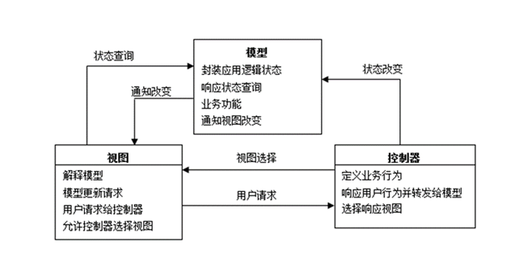

# 软件工程

> D11-3009 专属
>
> Author：Anand Zhang
>
> [资源地址](https://github.com/anandzhang/review-Junior-2019)

> 试卷分值情况：
>
> | 题型   | 个数（个） | 单个分值（分） | 总分值（分） |
> | ------ | ---------- | -------------- | ------------ |
> | 选择题 | 10         | 2              | 20           |
> | 填空题 | 10         | 1              | 10           |
> | 判断题 | 5          | 2              | 10           |
> | 简答题 | 5          | 4              | 20           |
> | 应用题 | 4          | 5              | 40           |

## 选择题

### 软件测试

#### 黑盒测试技术

黑盒测试是根据程序组件的规格说明测试软件功能的方法，所以也称为功能测试。由于被测对象作为一个黑盒子，它的功能行为只能通过研究其输入和输出来确定，所以又称为软件输入/输出接口测试。黑盒测试注重于功能和数据信息域的测试。

黑盒测试的一些测试方法：等价类划分、边界值分析、错误推测、因果图等。

##### 等价类划分

等价类划分是一种典型的黑盒测试方法。等价类是指某个输入域的集合，它表示对于揭露程序中的错误来说，集合中的每个输入条件是等效的。等价类划分的办法是把程序的输入域划分成若干等价类，然后从每个部分中选取少数代表性数据当作测试用例。

##### 边界值分析

边值分析法是列出单元功能、输入、状态及控制的合法边界值和非法边界值，设计测试用例包含全部边界值的方法。典型的包括IF语句中的判别值、定义域/值域边界等。

##### 错误推测

错误推测是依靠测试者的直觉和经验，推测可能存在的错误类型，从各种可能的测试方案中选择最可能发现错误的测试方案。常被用于“错误成群”现象的处理。

##### 因果图

因果图法就是从程序规格说明书的描述中找出因（输入条件）和果（输出或程序状态的改变），通过因果图转换为判定表，最后为判定表中的每一列设计一个测试用例。

> 由于等价类划分法并没有考虑到输入情况的各种组合。

#### 白盒测试技术

白盒测试是有选择地执行（或覆盖）程序中某些最有代表性路径的测试方法，所以也称为逻辑覆盖测试。

### 维护的四大类型

- 纠错性维护（Corrective Maintenance）：对在测试阶段未能发现的，在软件投入使用后才逐渐暴露出来的错误的测试、诊断、定位、纠错以及验证、修改的回归测试过程。纠错性维护占整个维护工作的21%。
- 完善性维护（Perfective Maintenance）：为了满足这些日益增长的新要求，需要修改或再开发软件，以扩充软件功能、增强软件性能、改进加工效率、提高软件的可维护性等。完善性维护所占的比重最大，大约占总维护量的50%以上。 
- 适应性维护：为了适应计算机的飞速发展，使软件适应外部新的硬件和软件环境或者数据环境（数据库、数据格式、数据输入/输出方式、数据存储介质）发生的变化，而进行修改软件的过程。适应性维护占整个维护工作的25%。
- 预防性维护（Preventive Maintenance）：为了提高软件的可维护性和可靠性等，主动为以后进一步维护软件打下良好基础的维护活动。大约占总维护量的5%。

### 软件工程基本原则

分阶段的软件开发、坚持进行阶段评审、实行严格的产品控制、采用先进的程序设计技术、明确责任、开发小组的人员少而精、不断改进开发过程

### 低耦合模式

- 低耦合模式是一个评价模式。
- 低耦合原则适用于软件开发的很多方面，它是构件软件最重要的目标之一。
- 指导原则是：分配职责以使耦合保持在较低的水平。

### 其他

软件的特征：复杂性、一致性、退化性、易变性、移植性、高成本

敏捷方法是一组敏捷实践技术的总称，包括极限编程、Scrum方法、结对编程等等

### 敏捷开发原则

- 我们最优先要做的是通过尽早的、持续的交付有价值的软件来使客户满意。
- 即使到了开发的后期，也欢迎改变需求。敏捷过程利用变化来为客户创造竞争优势。 
- 经常性地交付可以工作的软件，交付的间隔可以从几个星期到几个月，交付的时间间隔越短越好。
- 在整个项目开发期间，业务人员和开发人员必须天天都在一起工作。
- 围绕被激励起来的个体来构建项目，给他们提供所需的环境和支持，并且信任他们能够完成工作。
- 在团队内部，最具有效果并富有效率的传递信息的方法，就是面对面的交谈。
- 工作的软件是首要的进度度量标准。
- 敏捷过程提倡可持续的开发速度。责任人、开发者和用户应该能够保持一个长期的、恒定的开发速度。
- 不断地关注优秀的技能和好的设计会增强敏捷能力。 
- 简单是最根本的。 
- 最好的构架、需求和设计出于自组织团队。 
- 每隔一定时间，团队会在如何才能更有效地工作方面进行反省，然后相应地对自己的行为进行调整。

### Scrum 开发过程

- Scrum 是一种迭代式增量软件开发过程，适合于敏捷软件开发。
- Scrum的基本假设：开发软件就像开发新产品，无法一开始就能定义软件产品最终的方案，过程中需要研发、创意、尝试错误，所以**没有一种固定的流程可以保证方案成功**。
- Scrum 有明确的最高目标，熟悉开发流程中所需具备的最佳典范与技术，具有高度自主权，紧密地沟通合作，以高度弹性解决各种挑战，确保每天、每个阶段都朝向目标有明确的推进。

## 填空题

1. 软件的三要素：**程序**、**文档**、**数据**
2. 软件工程的三要素：方法、过程、工具
3. 软件过程是为了开发出软件产品，或者是为了完成软件工程项目而需要完成的有关软件工程的活动。通常使用**生存周期模型**简洁地描述软件过程。
4. 设计分为模块设计、数据库设计、界面设计、架构设计
5. 极限编程有四个要素：**交流**、**简单**、**反馈**、**勇气**
6. MVC模式采用将模型（Model）、视图（View）和控制器（Controller）相分离的思想。
7. 代码复杂度 P120 环复杂度 （判断节点+1）3

## 判断题

错的多

## 简答题

### 软件生存周期是什么？

软件生存周期就是软件**从生到死的过程**，也称为软件生命周期。

软件生存周期可划分为**定义、开发和运行**三个时期，每个时期又细分为若干个阶段。把整个软件生存周期划分为若干阶段，使得每个阶段有明确的任务，使规模大，结构复杂和管理复杂的软件开发变的容易控制和管理。

软件生存周期包括**问题的定义与可行性分析、项目计划、需求分析、软件设计、编码与测试、维护**等阶段，每个阶段又包含一系列的活动。

### 画程序流程图

比三个数最大值或者最小值

### MVC 结构图

### 软件配置管理

软件配置（Software Configuration）是一个软件各种形式、各种版本的文档和程序的总称

软件配置管理（SCM，Software Configuration Management）是对软件变更（或称为进化）过程的管理：变更不可避免、管理变更的能力是项目成败的关键。

软件配置管理是应用于整个软件过程的保护性活动，也可被视为整个软件过程的质量保证活动之一。

### 软件生命周期有几个阶段？几个任务？

软件生存周期可划分为**定义、开发和运行**三个时期，每个时期又细分为若干个阶段。

六个阶段：

- 问题的定义与可行性分析
- 项目计划
- 需求分析
- 软件设计
- 编码与测试
- 运行与维护

### 简述面向对象构件设计的原则

- 开关原则(The Open-Closed Principle, OCP)：模块应该对外延具有开放性，对修改具有封闭性。 替换原则(Subsitution Principle, SP)：子类可以替换它们的基类。
- 依赖倒置原则(Dependency Inversion Principle, DIP)：依赖于抽象、而非具体实现
- 接口分离原则(Interface Segregation Principle, ISP)：多个用户专用接口比一个通用接口要好。
- 发布复用等价性原则（Release Reuse Equivalency Principle, REP）：复用的粒度就是发布的粒度。
- 共同封装原则（Common Closure Principle, CCP）：一同变更的类应该和在一起。
- 共同复用原则（Common Reuse Principle，CRP）：不能一起复用的类不能被分到一组。

### 软件规模的度量方法

- 代码行方法
- 软件科学方法
- 可测量数据方法
- 功能点度量方法
- 面向对象的度量

## 应用题

### 系统用例图

用例图包括：**参与者、用例、关联和边界**四个要素。

- 参与者：用小人形表示

- 用例：用椭圆表示
- 关联：用直线表示说明参与者驱动某个用例
- 边界：用矩形框表示，说明系统关注点。

### 用例规约

| **用例不同部分**     | **说明**                             |
| -------------------- | ------------------------------------ |
| **用例名称**         | 以动词开始描述用例名称               |
| **范围**             | 要设计的系统                         |
| **级别**             | “用户目标”或者是“子功能”             |
| **主要参与者**       | 调用系统，使之交付服务               |
| **渋众及其关注点**   | 关注该用例的人，及其需要             |
| **前置条件**         | 开始前必须为真的条件                 |
| **成功保证**         | 成功完成必须满足的条件               |
| **主成功场景**       | 典型的、无条件的、理想方式的成功场景 |
| **扩展**             | 成功或失败的替代场景                 |
| **特殊需求**         | 相关的非功能性需求                   |
| **技术和数据变元素** | 不同的I/O方法和数据格式              |
| **发生频率**         | 影响对实现的调查、测试和时间安排     |
| **杂项**             | 未决问题等                           |

> 例：
>
> **用例名称：**处理一次销售
>
> **范围**：POS机应用
>
> **级别**：用户目标
>
> **主要参与者**：收银员
>
> **涉众及其关注点**：
>
> - 收银员：希望能够准确、快速地输入，而且没有支付错误，因为如果少收货款，将从其薪水众扣除。
>
> - 售货员：希望自动更新销售提成
>
> - 顾客：希望以最小代价完成购买活动并得到快速服务。希望便捷、清晰地看到所输入的商品项目和价格。希望得到购买凭证，以便退货。
>
> - 公司：希望准确地记录交易，满足顾客要求。希望确保记录了支付授权服务的支付票据。希望有一定的容错性，即便在某些服务器构件不可用时（如远程信用卡验证），也能够完成销售。希望能够自动、快速地更新帐户和库存信息。
>
> - 经理：希望能够快速执行超控操作，并易于更正收银员的不当操作。
>
> **前置条件**：收银员必须经过确认和认证。
>
> **成功保证（或后置条件）**：存储销售信息，更新帐户和库存信息，记录提成，生成票据，记录支付授权的批准。

### 业务类图

根据一个用例画类图，表面类之间的关系

### 序列图 BCE

- **边界类**：边界类用于建立系统与其参与者之间交互的模型，经常代表对窗口、窗体、窗幕、通信接口、打印机接口、传感器、终端以及API等的抽象。
  - 每个边界类至少应该与一个参与者有关，反之亦然。

- **控制类**：控制类代表协调、排序、事务处理以及其他对象的控制，经常用于封装与某个具体用例有关的控制。
  - 控制类还可以用来表示复杂的派生与演算，如业务逻辑。

- **实体类**：实体类用于对长效持久的信息建模。大多数情况下，实体类是直接从业务对象模型中相应的业务实体类得到的