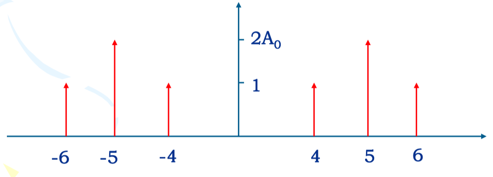
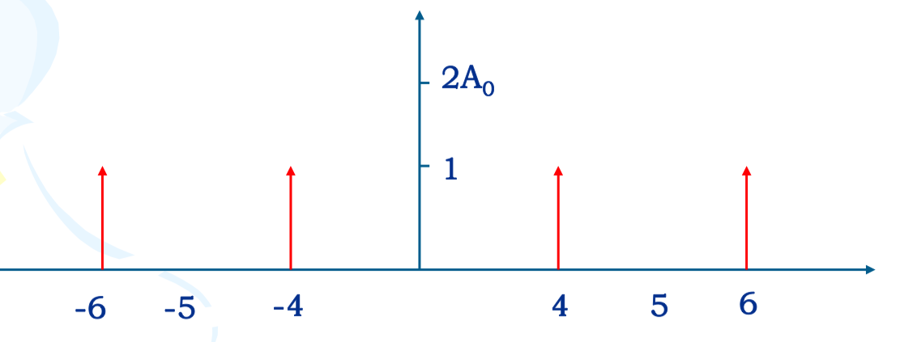
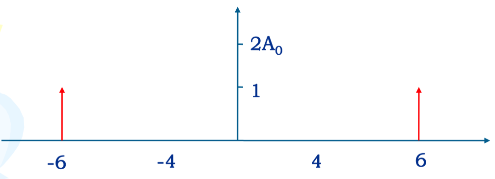
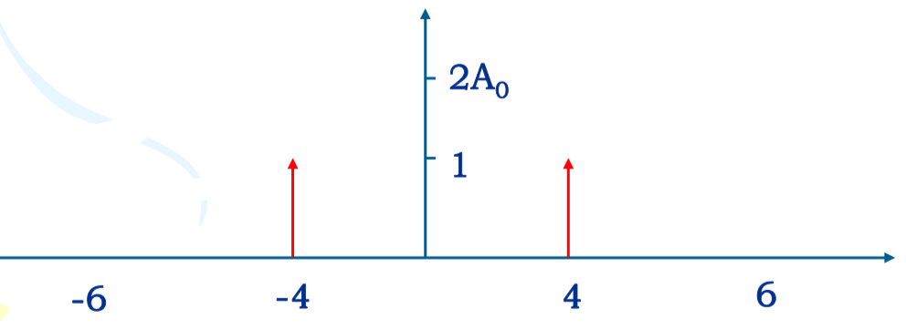

# 通信原理

> D11-3009 专属
>
> Author：Anand Zhang
>
> [资源地址](https://github.com/anandzhang/review-Junior-2019)

## 客观题

1. 与模拟通信相比，数字通信的优点：
   - 抗干扰能力强，可靠性高
   - 体积小，功耗低，易于集成
   - 便于进行各种数字信号处理
   - 有利于实现综合业务传输
   - 便于保密
2. 区分线性调制和非线性调制：

3. 通信系统按信号复用方式分类：**频分复用**、**时分复用**、**码分复用**。

4. 从消息传输的角度来说，通信的 **有效性**  与 **可靠性** 是主要的性能指标。

   > 有效性：消息传输的“速度”问题；可靠性：消息传输的“质量”问题。
   >
   > 这是两个相互矛盾的问题，这对矛盾通常只能根据实际需求取得相对统一。

5. 码元传输速率Rs：每秒钟传输的码元个数，单位波特（Baud），记作B。码元传输速率简称传码率/符号速率。
   $$
   R_s=\frac {1}{T_s}(Baud)
   $$
   Ts为码元间隔。

6. 信息传输速率Rb：单位时间内传递的信息量或比特数，单位比特/秒，记为bit/s。信息传输速率简称传信率/比特率。

   对于二进制数字通信系统，传输的是**二进制码元**。系统的信息速率在数值上等于码元速率，但两者的含义不同。

   对于 M 进制数字系统：
   $$
   R_b=R_s*log_2M(bit/s)
   $$

7. 频带利用率η：传输速率与频带宽度之比，即单位频带内的传输速率。
   $$
   η=\frac {R_s}{B}(Baud/H_z)
   $$
   或
   $$
   η=\frac {R_b}{B}(bit/(s*H_z))
   $$
   B 为所需信道带宽。

8. 信道一般有两种定义：狭义信道和广义信道。

   狭义信道：通常把发送设备和接受设备之间用以传输信号的 **传输媒介** 定义为狭义信道。

   广义信道：**除了传输媒介外**，还可以包括有关的转换器，通常将这种扩大了范围的信道称为广义信道。

   广义信道也可分为：**调制信道** 和 **编码信道**。

   > 调制信道中传输的为模拟信号，编码信道中传输的为数字信号。

9. 基带信号经过 调制后/解调前 的信号为已调信号。

10. 信道对信号的影响可归纳为：**乘性干扰** k(t)、**加性干扰**n(t)。

11. 调制信道分为：恒参信道、随参信道。

    恒参信道：k(t) 可看成不随时间变化或变化缓慢的一类信道

    随参信道：k(t) 是随时间变化随机变化的信道

12. 随参信道特点（了解？）

    - 信号的衰耗随时间随机变化
    - 信号传输的时延随时间随机变化
    - 多径传播

13. 信道容量

    设信道带宽B(Hz)，信号功率为S(W)，加性高斯噪声功率为N(W)，则可以证明该信道的信道容量为 
    $$
    C=B\log_2(1+\frac SN)
    $$
    这个式子就是香农公式，它的另一种形式：
    $$
    C=B\log_2(1+\frac{S}{n_0B})
    $$

14. 调制

    定义：通过基带信号改变载波的某个参数，实现基带信号的频谱搬移。

    目的：1. 基带信号转化为频带信号(已调信号) 2. 提高信道利用率 3. 增强抗干扰能力

15. 通过对载波参数进行改变可以把调制分为：**调幅**(幅度)、**调频**(频率)、**调相**(相位)。

16. 线性调制：振幅调制（AM）、双边带调制（DSB）、单边带调制（SSB）、残留边带调制（VSB）。

    它们的频带宽度(带宽)比较：AM = DSB > VSB > SSB。

17. 实现模拟信号数字化需要进行**抽样**、**量化**和**编码**。

    模拟信号数字化会造成信号失真，但是不会造成干扰。

18. 低通抽样定理：一个频带限制在 (0，fH)   内的时间连续信号 m(t)，如果抽样频率 fs  大于或等于  2fH，则可以由样值序列 ms(t) 无失真的重建原始信 m(t)。

19. 非均匀量化的优点/目的：

    - 当输入量化器的信号具有非均匀分布的概率密度时，非均匀量化器的输出端可得较高的平均信号量化噪声功率比。
    - 非均匀量化时，量化噪声功率的均方根值基本上与信号抽样值成正比。因此，量化噪声对大、小信号的影响大致相同。即改善小信号时的量化噪声比。

20. 美国采用 μ压缩律，我国和欧洲各国采用 A律压缩（A压缩律）。

21. 脉冲编码调制（PCM）：把模拟信号变换为数字信号的一种调制方式。

    原理：**首先**，对模拟信号进行抽样，将时间和幅值都连续的模拟信号转化为时间离散、幅值连续的抽样信号。**然后**，对抽样信号进行量化，将时间离散、幅值连续的抽样信号转换为时间和幅值都离散的量化信号。**最后**，进行编码，将时间和幅值都离散的量化信号转换为二进制数字信号。

22. 抽样判决器（P153）：它的作用是在信道特性不理想及有噪声干扰的情况下，正确恢复出原来的基带信号（了解）。抽样判决采用**位同步信号**。

23. 区分基带信号常见码型：

    - 二元码
    - 三元码 P157：有正负的
    - HDB3码

24. 为什么产生码间串扰？

    由于系统传输总特性不理想，导致前后码元波形畸变展宽，使前面波形出现很长的拖尾，蔓延到当前抽样信号从而对码元的判决造成干扰。

25. 怎么消除码间串扰？

    最好让前一个码元的波形在到达后一个码元抽样判决时刻已衰减到0。

26. 使用示波器观察眼图。P179

27. 时域均衡：能减少码间串扰的影响。

28. 数字调制和模拟调制比较：

    相同点：

    - 载波相同，都是对正弦载波进行调制
    - 调制目的相同，都是把基带信号频谱搬移到正弦载波频率附近，以便与信道频率特性相匹配。
    - 调制参数相同，由于正弦波有振幅、频率和相位3个参量，因而相应地两者都有振幅调制（AM、ASK）、频率调制（FM、FSK）、相位调制（PM、PSK）3中调制方式。

    不同点：

    | 类型     | 调制信号             | 调制过程                           | 解调过程                     |
    | -------- | -------------------- | ---------------------------------- | ---------------------------- |
    | 模拟调制 | 模拟信号（连续取值） | 以调制信号对载波参量作连续调制     | 对已调载波的参量作连续估值   |
    | 数字调制 | 数字信号（离散取值） | 以载波参量的离散状态来表征数字信号 | 对已调载波的离散参量进行检测 |

29. 二进制数字调制系统比较 P238

    2FSK 是带宽最大，频带利用率最小。

30. 与二进制调制相比，多进制数字调制的优点是可以提高频带利用率 ηb。

## 主观题

1. 2-3 设一恒参信道的幅频特性和相频特性分别为：
   $$
   \begin{split}
   H(ω)=K_0 \\
   φ(ω)=-ωt_d
   \end{split}
   $$
   其中，$K_0$ 和 $t_d$ 是常数。试确定信号 $s(t)$ 通过该信道后的输出信号的时域表达式。

   > 解：传输函数：$H(ω)=|H(ω)|e^{jφ(ω)}=K_0e^{-jωt_d}$ 
   > $$
   > \begin{split}
   > s(t)&=\frac 1{2\pi}\int_{-\infty}^{+\infty}K_0e^{-jωt_d}e^{jωt}\mathrm{d}w \\
   > &=\frac {K_0}{2\pi}\int_{-\infty}^{+\infty}e^{jω(t-t_d)}\mathrm{d}w \\
   > \end{split}
   > $$
   > 由于 $s(t-td)=\frac 1{2\pi}\int_{-\infty}^{+\infty}e^{-jωt_d}e^{jωt}\mathrm{d}w$ 
   >
   > 则 $s(t)=K_0s(t-t_d)$ 
   >
   > 输出信号 $y(t)=s(t)*h(t)=K_0s(t-t_d)$ 

   > 相关：
   >
   > 傅立叶变换对：
   > $$
   > \begin{split}
   > s(t)&\rightleftharpoons1 \\
   > s(t-t_0)&\rightleftharpoons e^{-j\omega t_0} \\
   > 1&\rightleftharpoons 2\pi s(\omega) \\
   > e^{j\omega t}&\rightleftharpoons 2\pi s(\omega-\omega_0)
   > \end{split}
   > $$

2. 2-4 设一恒参信道的传输特性为 $H(ω)=[1+cosωT_0]e^{-jωt_d}$ ，其中，$t_d$ 是常数。试确定信号 $s(t)$ 通过该信道后的输出信号表达式。

   > 解：
   > $$
   > \begin{split}
   > H(ω)&=[1+cosωT_0]e^{-jωt_d} \\
   > &=e^{-jωt_d} + cosωT_0*e^{-jωt_d} \\
   > &=e^{-jωt_d} + \frac 12(e^{jωT_0}+e^{-jωT_0})e^{-jωt_d}
   > \end{split}
   > $$
   >
   > $$
   > h(t)=s(t-t_d)+\frac 12s(t-t_d+T_0)+\frac 12s(t-t_d-T_0)
   > $$
   >
   > 则输出信号：$y(t)=s(t)*h(t)=s(t-t_d)+\frac 12s(t-t_d+T_0)+\frac 12s(t-t_d-T_0)$ 

   > 相关：
   >
   > 欧拉公式：
   > $$
   > \begin{split}
   > e^{j\omega t}&=cos\omega t+jsin\omega t \\
   > e^{-j\omega t}&=cos\omega t-jsin\omega t
   > \end{split}
   > $$

3. 【例 3-1】已知调制信号 $m(t)=cos(2000\pi t)$ ，载波为 $2cos10^4\pi t$ ，分别写出AM、DSB、USB和LSB信号的表达式，并画出频谱图。

   > 解：
   >
   > AM信号：
   > $$
   > \begin{split}
   > s_{AM}(t)&=2[A_0+cos(2000\pi t)]*cos10^4\pi t\\
   > &=2A_0cos10^4\pi t+cos(1.2*10^4\pi t)+cos(0.8*10^4\pi t)
   > \end{split}
   > $$
   > DSB信号：
   > $$
   > \begin{split}
   > s_{DSB}(t)&=2cos(2000\pi t)*cos10^4\pi t \\
   > &=cos(1.2*10^4\pi t)+cos(0.8*10^4\pi t)
   > \end{split}
   > $$
   > USB信号：
   > $$
   > s_{USB}(t)=cos(1.2*10^4\pi t)
   > $$
   > LSB信号：
   > $$
   > s_{LSB}(t)=cos(0.8*10^4\pi t)
   > $$
   > 其频谱图分别如图：
   >
   > 
   >
   > 
   >
   > 
   >
   > 

   > USB 上边带；LSB 下边带。
   >
   > $\omega=2\pi f$ 去求 $f=\frac{\omega}{2\pi}$ 
   >
   > cos里进行比较：大就是USB

4. 【例 3-3】已知某单频调频波的振幅是10V，瞬时频率为 $f(t)=10^6+10^4cos2\pi*10^3t(Hz)$ ，试求：1.此调频波的表达式 2.此调频波的频率偏移、调频指数和频带宽度 3.若调制信号频率提高到 $2*10^3Hz$ ，调频波的频偏、调频指数和频带宽度如何变化？

   > 解：
   >
   > 1.
   >
   > 该调频波的瞬时角频率为：
   > $$
   > ω(t)=2\pi f(t)=2\pi*10^6+2\pi*10^4cos2\pi*10^4t\quad(rad/s)
   > $$
   > 此时，该调频波的总相位 $\theta(t)$ 为：
   > $$
   > \theta(t)=\int_{-\infty}^t\omega(\tau)d\tau=2\pi*10^6t+10sin2\pi*10^3t
   > $$
   > 因此，调频波的时域表达式：
   > $$
   > s_{FM}(t)=Acos\theta(t)=10cos(2\pi*10^6t+10sin2\pi*10^3t)\quad (V)
   > $$
   >  2.
   >
   > 根据频率偏移的定义：
   > $$
   > \Delta f=|\Delta f|_{max}=|10^4cos2\pi*10^3t|_{max}=10(kHz)
   > $$
   > 调频指数为：
   > $$
   > m_f=\frac{\Delta f}{f_m}=\frac{10^4}{10^3}=10
   > $$
   > 满足 $m_f>>1$ ，认为是宽带调频，因此由 $B_{WBFM}\approx2(m_f+1)f_m=2(\Delta f+f_m)$ 得：
   > $$
   > B=2(\Delta f+f_m)=2*(10+1)=22(kHz)
   > $$
   > 3.根据题意调频信号的频率偏移仍然是 $\Delta f=10kHz$ ，此时调频指数：
   > $$
   > m_f=\frac{\Delta f}{f_m}=\frac{10^4}{2*10^3}=5
   > $$
   > 相应的调频信号的带宽为：
   > $$
   > B\approx2(\Delta f+f_m)=2*(10+2)=24(kHz)
   > $$
   > 所以调制信号频率 $f_m$ 增加了一倍，但调频信号的带宽B变化很小。

5. 【例 4-2】设输入信号抽样值 $I_s=+1200\Delta$ （$\Delta$ 为一个量化单位，表示输入信号归一化值的1/2048），采用逐次比较型编码器，按A律13折线编码成8位码$C_1C_2C_3C_4C_5C_6C_7C_8$。

   > ① 确定极性码 $C_1$ ：由于输入信号抽样值 $I_s$ 为正，故极性码 $C_1=1$  。
   >
   > ② 确定段落码：由13折线的编码和量化电平表得 $I_s$  处于13折线8个段落中的第8段 $I_s>1024\Delta$ ，所以段落码 $C_2C_3C_4$ 为“111”。
   >
   > ③ 确定段内码：由13折线的编码和量化电平表得第8段的量化间隔 $\Delta8=64\Delta$ ，$I_s=1024+64*2+48\Delta$ 的 $I_s$ 处于序号为2的量化间隔，故段内码 $C_5C_6C_7C_8$ 为“0010”。
   >
   > 则：PCM码组为11110010

6. P209 6-2